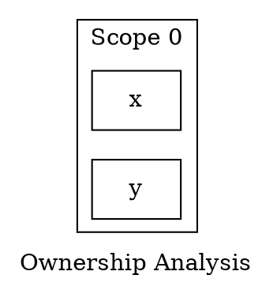

# RustVisualizer

一个基于 AST 的 Rust 代码所有权与生命周期静态分析工具。

## 项目简介

RustVisualizer 是一个用于静态分析 Rust 代码所有权和生命周期的工具。它通过解析 Rust 源代码的抽象语法树（AST），追踪变量的所有权转移、借用关系和生命周期，帮助开发者理解和可视化 Rust 的内存管理模型。

## 核心功能

- **所有权分析**: 追踪变量的所有权转移和状态变化
- **借用分析**: 分析不可变借用和可变借用的关系
- **生命周期追踪**: 计算引用变量的有效作用域
- **可视化输出**: 生成 DOT 格式和 SVG 图像展示分析结果
- **作用域追踪**: 分层展示变量在不同作用域中的状态

## 版本历史

| 版本 | 代号 | 说明 | 日期 |
|------|------|------|------|
| MVP | 破土 | 基础解析和简单变量追踪 | 2026年5月 |
| v1.0 | 根基 | 完整所有权与借用分析 | 2026年6月 |
| v2.0 | 绽放 | 可视化输出与 DOT 导出 | 2026年6月 |

## 快速开始

### 安装

```bash
# 克隆仓库
git clone https://github.com/Ripple-Chance/rust_visualizer.git
cd rust_visualizer

# 编译项目
cargo build --release

# 运行工具
cargo run --release -- <your_rust_file.rs>
```

### 基本使用

```bash
# 分析单个文件
cargo run --release -- examples/demo.rs

# 分析并输出 DOT 格式
cargo run --release -- examples/ownership_test.rs --dot output.dot

# 分析并输出 SVG 格式
cargo run --release -- examples/ownership_test.rs --svg output.svg
```

## 功能示例

### 所有权分析

```rust
fn main() {
    let x = String::from("hello");  // x 获得所有权
    let y = x;                      // 所有权转移到 y，x 不再有效
    
    println!("{}", y);              // 正确使用 y
}
```

### 借用分析

```rust
fn main() {
    let mut data = vec![1, 2, 3];
    
    let reference = &data;           // 不可变借用
    println!("{:?}", reference);     // 使用借用
    
    data.push(4);                   // 可变借用
    println!("{:?}", data);         // 使用可变数据
}
```

## 项目结构

```
rust_visualizer/
├── src/
│   ├── main.rs              # 主程序入口
│   ├── lib.rs               # 库入口
│   ├── error.rs             # 错误处理
│   ├── parser/              # AST 解析模块
│   │   ├── ast_visitor.rs   # AST 访问器
│   │   └── events.rs        # 分析事件定义
│   ├── analysis/            # 分析引擎
│   │   ├── ownership.rs     # 所有权分析
│   │   ├── borrow.rs        # 借用分析
│   │   └── lifetime.rs      # 生命周期分析
│   └── graph/               # 可视化模块
│       ├── variable_graph.rs # 变量关系图
│       ├── dot_export.rs     # DOT 格式导出
│       └── svg_renderer.rs   # SVG 渲染器
├── examples/                # 示例代码
├── tests/                   # 测试用例
└── Cargo.toml              # 项目配置
```

## 技术栈

- **syn**: Rust AST 解析
- **petgraph**: 图数据结构
- **proc-macro2**: 代码位置处理
- **clap**: CLI 参数解析
- **thiserror**: 错误处理

## 测试

```bash
# 运行所有测试
cargo test

# 运行特定测试
cargo test --test v2_visualization

# 运行文档测试
cargo test --doc
```

## 输出示例

### DOT 格式输出



### SVG 可视化

工具可以生成 SVG 格式的可视化图像，包括：
- 变量节点（按所有权状态着色）
- 借用关系箭头
- 作用域分组
- 图例说明

## 使用场景

1. **学习 Rust 所有权机制**: 通过可视化加深对所有权的理解
2. **代码审查**: 检查代码中的所有权和借用问题
3. **调试**: 追踪复杂的借用关系
4. **教学**: 在教学中展示 Rust 的内存管理

## 文档

- [使用说明](USAGE.md) - 详细的使用指南
- [版本说明](V2_VERSION_NOTES.md) - v2.0.0 功能介绍
- [迭代计划](ITERATION_PLAN.md) - 开发计划

## 许可证

MIT License

## 作者

Ripple-Chance

## 贡献

欢迎提交 Issue 和 Pull Request！
